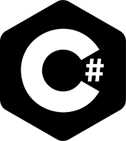
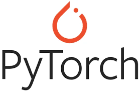
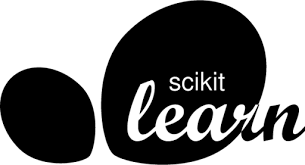

Hi there, I'm Adham! 👋

## 👦 About Me
- 🎓 I'm currently a master's Computer Science student in the University of York
- ⚛️ I am very interested in machine learning and neural networks
- ❤️ I enjoy working on personal side projects

 

## 🛠️ Languages and Tools

 
 

## 🏆 My Github stats

